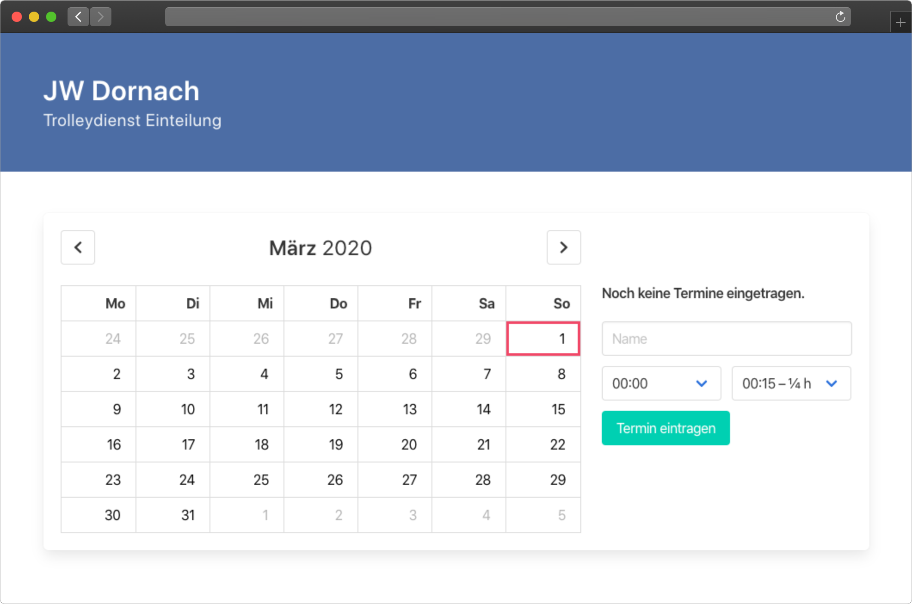

# Dornach 

A Elixir app which helps to organize the cart service of the Linz-Dornach
congregation of Jehovah's Witnesses.

## Setup

- Create a project in [Google Console](https://console.cloud.google.com).
- Create a service account with a **Project > Editor** role in Google Console.
- Share the calendar in Google Calendar with this service account and ensure it
  can **Make changes to events**.

- Create a key for the service account and download it as JSON.

## Configuration

| ENV                              | Description                                                                                                                  |
|----------------------------------|------------------------------------------------------------------------------------------------------------------------------|
| `GOOGLE_APPLICATION_CREDENTIALS` | The contents of the JSON key file obtained above.                                                                            |
| `GOOGLE_CALENDAR_ID`             | The ID of the Google Calendar which will work as the database. Eg: `abcdefghijklmnopqrstuvwxyz@group.calendar.google.com` |

## License

[MIT](./LICENSE.md)
