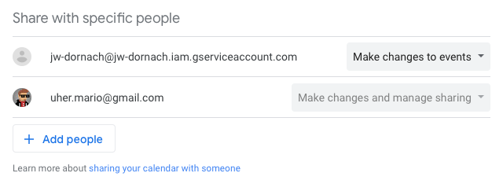

# Dornach

# Configuration

- Create a service account with a **Project > Editor** role in [Google Console](https://console.cloud.google.com/iam-admin/serviceaccounts).
- Share the calendar in Google Calendar with this service account and ensure it can **Make changes to events**.

- Create a key for the service account and download it as JSON.
